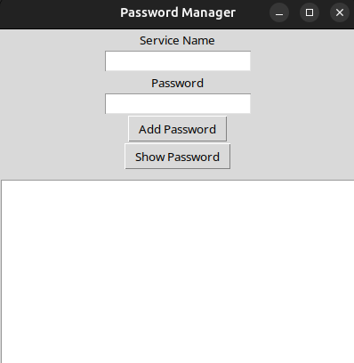
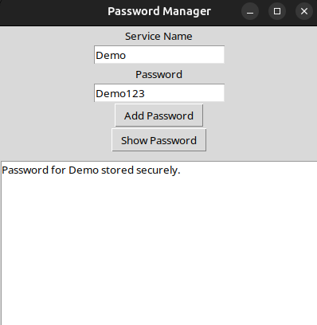
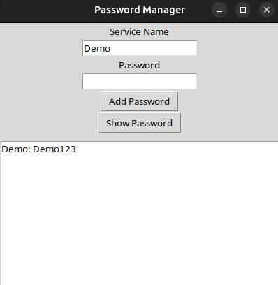

# Password Manager

A simple command-line password manager that uses AES encryption to store and retrieve passwords securely.

## Features:
- **AES Encryption**: Encrypts passwords using AES (via the `cryptography` library).
- **Secure Storage**: Passwords are stored in an encrypted format.
- **Retrieve Passwords**: Allows retrieval of stored passwords by service name.

## Screenshots





## Installation:

1. Clone the repository:
   ```bash
   git clone https://github.com/Hasifkhan/Password-Manager-with-AES-encryption.git
   cd password_manager
